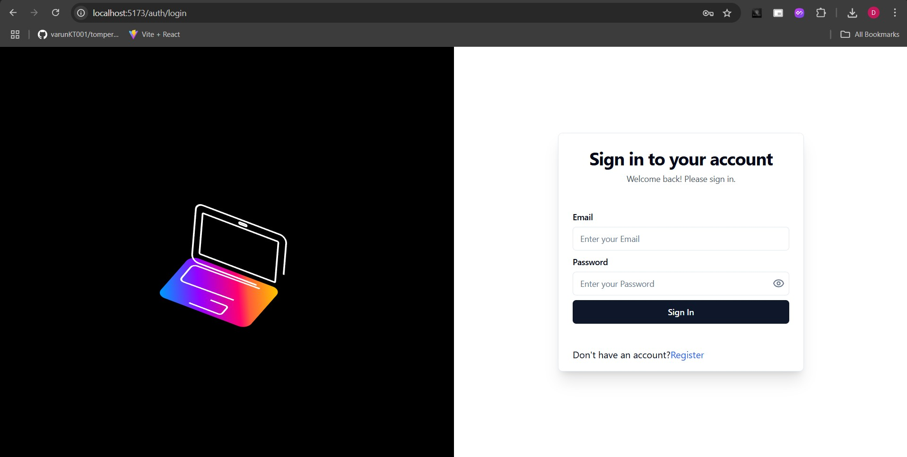

# 🛍️ WebWear

## A Modern E-Commerce Platform Built with MERN Stack, Redux Toolkit & Tailwind CSS

**WebWear** is a modern fashion e-commerce site designed to deliver a seamless shopping experience. It integrates a React frontend with a Node.js + Express backend, secured with JWT and powered by MongoDB for data persistence. Cloudinary is used for image uploads and PayPal for payment processing.




---

## 📁 Project Structure

```
/client      → React Frontend  
/server      → Node.js + Express Backend  
/.env        → Environment variables (server)  
```

---

## ⚙️ Environment Variables

Create a `.env` file inside the `server` folder and add the following:

```env
PORT=3000
DB_URL="your DB url"
SECRET_KEY='your key'

CLOUD_NAME= your cloud name
API_KEY= cloud api key
API_SECRET=cloud secret key

CLIENT_ID="paypal client id"
PP_SECRET_KEY="paypal secret key"
```

> ⚠️ **Warning**: Never expose your `.env` file publicly or commit it to version control.

---

## 🛠️ Setup Instructions

### 📥 Clone the Repository

```bash
git clone https://github.com/yourusername/webwear.git
cd webwear
```

---

### 📦 Install Dependencies

Install frontend:

```bash
cd client
npm install
```

Install backend:

```bash
cd ../server
npm install
```

---

### 🚀 Start the Development Servers

Start the backend server:

```bash
cd server
npm run dev
```

Start the frontend server:

```bash
cd ../client
npm start
```

---

## 🌍 URLs

- **Frontend** → `http://localhost:5173`
- **Backend** → `http://localhost:3000`

---

## Authors
- [@DhruvSolanki](https://github.com/Dhruv16204)
